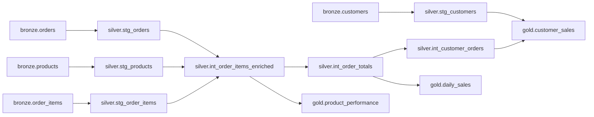

# Data Product Incident: INC-2026-0815

## Incident report

Finance has reported that completed-order revenue for `2026-08-15` in
`gold.daily_sales` is higher than the transaction-system control total. The
completed order count appears correct, and initial checks suggest other dates
are unaffected.

Investigate the discrepancy, determine its root cause and blast radius,
correct the pipeline, rerun it through Airflow, and demonstrate that the
affected metrics now reconcile.

You have 90 minutes. The exercise ends with a 5-10 minute verbal walkthrough
of your investigation and remediation.

## Architecture

The source data and all materialized models are stored in the PostgreSQL
database provided by the facilitator.



Airflow orchestrates the SQL files in `scripts/sql/`. The participant DAG is
`rca_sales_pipeline`; the setup DAG is reserved for the facilitator.

## Connect with pgAdmin

Create a PostgreSQL server connection using the database credentials supplied
by the facilitator:

- Host: supplied `DB_HOST`
- Port: supplied `DB_PORT` (normally `5432`)
- Database: supplied `DB_NAME`
- Username: supplied `DB_USER`
- Password: supplied `DB_PASSWORD`
- SSL mode: `Require`

Do not place credentials in SQL files or commit a populated `.env` file.

## Confirm the incident

Run this query in pgAdmin before changing any pipeline code:

```sql
with source_control as (
    select
        order_ts::date as order_date,
        sum(order_total) as expected_revenue
    from bronze.orders
    where status = 'completed'
    group by 1
)
select
    g.order_date,
    g.revenue as gold_revenue,
    s.expected_revenue,
    g.revenue - s.expected_revenue as variance
from gold.daily_sales g
join source_control s using (order_date)
where g.revenue <> s.expected_revenue
order by g.order_date;
```

Save the result. You will rerun the same query after your remediation.

## Your mission

1. Confirm the incident and quantify its business impact.
2. Follow the lineage and identify the earliest model where the data no longer
   satisfies its intended business grain.
3. Determine which dates, customers, products, and metrics are affected.
4. Correct the responsible SQL transformation in `scripts/sql/`.
5. Run `rca_sales_pipeline` locally through Airflow.
6. Prove that the gold output reconciles with the source control.
7. Recommend one automated data-quality control that would detect a recurrence.

## Rules

- Do not manually update or delete records in PostgreSQL.
- Do not change the bronze seed data.
- Do not hard-code corrected values in a gold model.
- Fix the earliest incorrect transformation in the pipeline.
- Your solution must produce the same result on repeated DAG runs.

## Run Airflow locally

From the repository root, copy the existing environment template and fill in
the values supplied by the facilitator:

```text
copy .env.example .env
```

Build and start the existing Airflow environment:

```text
docker build -t airflow-spark .
docker compose -f airflow.yaml up -d
```

Open `http://localhost:8080`, sign in using the Airflow UI values from `.env`,
and trigger `rca_sales_pipeline`. You can also trigger it from the terminal:

```text
docker compose -f airflow.yaml exec scheduler airflow dags trigger rca_sales_pipeline
```

Wait for all ten model tasks to succeed, then rerun the reconciliation query in
pgAdmin. Stop the environment when you finish:

```text
docker compose -f airflow.yaml down
```

## Verbal walkthrough

Be ready to explain:

- How you confirmed and scoped the incident.
- The evidence that led you through the lineage.
- The first model where the business grain was violated.
- The underlying data condition and transformation behavior.
- The affected dates, customers, products, and revenue.
- Why your SQL correction is deterministic.
- Your before-and-after reconciliation results.
- The automated control you would add to prevent recurrence.

## Completion checklist

- [ ] The original incident result is saved.
- [ ] The root cause and blast radius are supported by SQL evidence.
- [ ] Only the appropriate transformation SQL is changed.
- [ ] `rca_sales_pipeline` succeeds in local Airflow.
- [ ] The reconciliation query returns no mismatched dates.
- [ ] A second DAG run produces the same counts and metrics.
- [ ] A preventive data-quality control is proposed.
